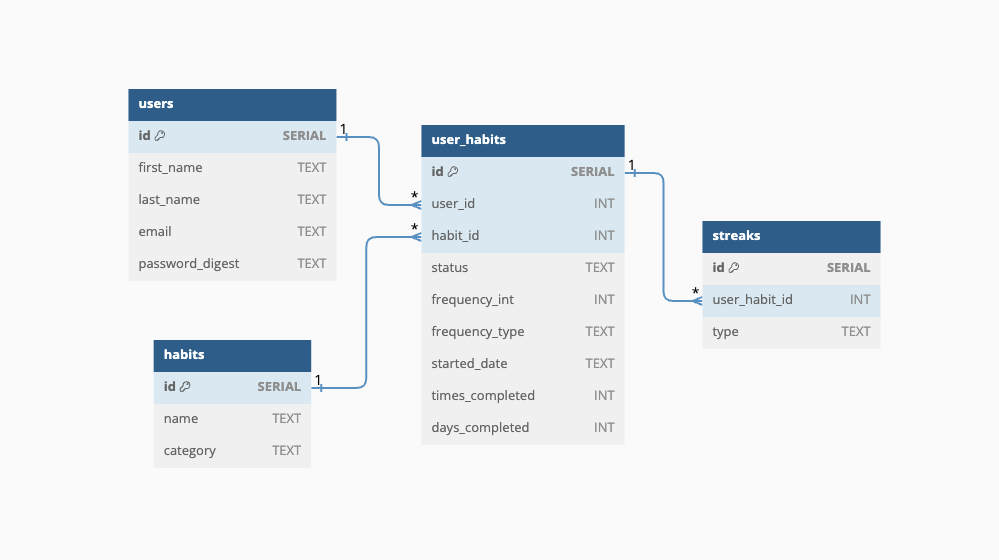

# Habit Heroes BE

### [Live Deployment](https://powerful-scrubland-99007-c4aa236ac7c5.herokuapp.com/)

### About

This is an API-only application.

### Setup

```
[Fork and clone this repository]

cd app_name

bundle install
rails db:{drop,create,migrate,seed}
rails s

[Open LocalHost:5000]
```

### Versions

- Ruby 3.2.2
- Rails 7.1.3.4

### Database Schema



### Exposed End Points

<details>
  <summary> End Point 1 - Retrieve a User </summary>

**Request**

```http
GET /api/v1/users/1
Content-Type: application/json
Accept: application/json
```

**Response & Response Code** `200`

```json
{
  "data": {
    "id": 1,
    "type": "user",
    "attributes": {
      "first_name": "Grant",
      "last_name": "Davis",
      "email": "grant@gmail.com"
    }
  }
}
```
</details>

<details>
  <summary> End Point 2 - Retrieve a User's UserHabits </summary>

**Request**

```http
GET /api/v1/users/1/habits
Content-Type: application/json
Accept: application/json
```

**Response & Response Code** `200`

```json
{
  "data": [
    {
      "id": 1,
      "name": "Brush Teeth",
      "category": "dental",
      "status": "active",
      "goal_int": 2,
      "goal_type": "day",
      "started_date": "2024-07-11 20:27:54 -0600",
      "times_completed": 0,
      "days_completed": 10,
      "weeks_completed": 0
    },
    {
      "id": 2,
      "name": "Floss Teeth",
      "category": "dental",
      "status": "active",
      "goal_int": 2,
      "goal_type": "day",
      "started_date": "2024-07-11 20:27:54 -0600",
      "times_completed": 0,
      "days_completed": 10,
      "weeks_completed": 0
    }
  ]
}
```
</details>

<details>
  <summary> End Point 3 - Retrieve a User's Streaks </summary>

**Request**

```http
GET /api/v1/users/:id/streaks
Content-Type: application/json
Accept: application/json
```

**Response & Response Code** `200`

```json
{
  "data": [
    {
      "id": 1,
      "name": "Brush Teeth",
      "category": "dental",
      "goal_type": "day",
      "streak_type": "fire",
      "days_or_weeks_completed": 10
    },
    {
      "id": 2,
      "name": "Floss Teeth",
      "category": "dental",
      "goal_type": "day",
      "streak_type": "fire",
      "days_or_weeks_completed": 10
    }
  ]
}
```
</details>

<details>
  <summary> End Point 4 - Retrieve All Habits </summary>

**Request**

```http
GET /api/v1/habits
Content-Type: application/json
Accept: application/json
```

**Response & Response Code** `200`

```json
{
  "data": [
    {
      "id": 1,
      "name": "Brush Teeth",
      "category": "dental"
    },
    {
      "id": 2,
      "name": "Floss Teeth",
      "category": "dental"
    },
    {
      "id": 3,
      "name": "Rinse w/ Mouth Wash",
      "category": "dental"
    },
    {
      "id": 4,
      "name": "Sleep 8 Hours",
      "category": "sleep"
    },
    {
      "id": 5,
      "name": "Wake Up at 7am",
      "category": "productivity"
    },
    {
      "id": 6,
      "name": "Drink 100oz of Water",
      "category": "hydration"
    },
    {
      "id": 7,
      "name": "Read",
      "category": "hobby"
    },
    {
      "id": 8,
      "name": "Write",
      "category": "hobby"
    },
    {
      "id": 9,
      "name": "Walk 10,000 Steps",
      "category": "exercise"
    },
    {
      "id": 10,
      "name": "Lift Weights",
      "category": "exercise"
    }
  ]
}
```
</details>

<details>
  <summary> End Point 5 - Create a New UserHabit (w/ Body) </summary>

**Request**

```http
POST /api/v1/users/:id/habits
Content-Type: application/json
Accept: application/json
```

**Body**

```json
{
  "user_id": 1,
  "habit_id": 7
}
```

**Response & Response Code** `201`

```json
{
  "data": {
    "id": 4,
    "name": "Read",
    "category": "hobby",
    "status": "active",
    "goal_int": 3,
    "goal_type": "week",
    "started_date": "2024-07-12 17:50:44 -0600",
    "times_completed": 0,
    "days_completed": 0,
    "weeks_completed": 0
  }
}
```
</details>

<details>
  <summary> End Point 6 - Update a User's UserHabit (w/ Body) </summary>

**Request**

```http
PATCH /api/v1/users/:id/habits
Content-Type: application/json
Accept: application/json
```

**Body**

```json
{
  "user_habit_id": 12
}
```

**Response & Response Code** `200`

```json
{
  "data": {
    "id": 4,
    "name": "Read",
    "category": "hobby",
    "status": "active",
    "goal_int": 3,
    "goal_type": "week",
    "started_date": "2024-07-12 17:50:44 -0600",
    "times_completed": 1,
    "days_completed": 0,
    "weeks_completed": 0
  }
}
```
</details>

### Tests

* 69 Total Tests (795 / 795 LOC (100.0%) covered)
* 23 Request Tests (661 / 661 LOC (100.0%) covered)
* 46 Model Tests (209 / 209 LOC (100.0%) covered)

**Testing Instructions**

```
rails db:{drop,create,migrate,seed}
bundle exec rspec spec
```

### Resources

* [GitHub Project Board](https://github.com/orgs/habit-heroes/projects/1)

### Contributors

* Grant Davis | [GitHub](https://github.com/grantdavis303), [LinkedIn](https://www.linkedin.com/in/grantdavis303/)
